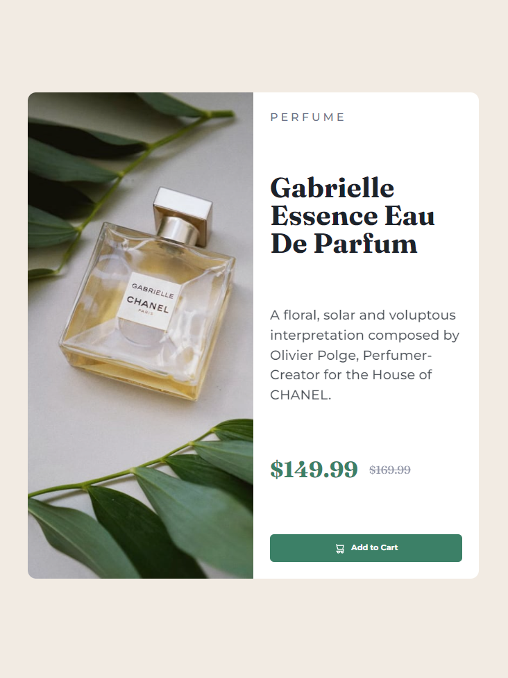

# Frontend Mentor - QR code component solution

Hi, Niels here.
This is a solution to the [Product preview card component challenge on Frontend Mentor](https://www.frontendmentor.io/challenges/product-preview-card-component-GO7UmttRfa). [Hosted on GH Pages](https://nielsfechtel.github.io/frontendmentor_1_recipe/).

## Table of contents

- [Frontend Mentor - QR code component solution](#frontend-mentor---qr-code-component-solution)
  - [Table of contents](#table-of-contents)
  - [Overview](#overview)
    - [Screenshot](#screenshot)
    - [What I learned](#what-i-learned)
  - [Author](#author)

## Overview

### Screenshot



### What I learned

```css

```

## Author

- Website - [Niels Fechtel](https://niels-fechtel.com)
